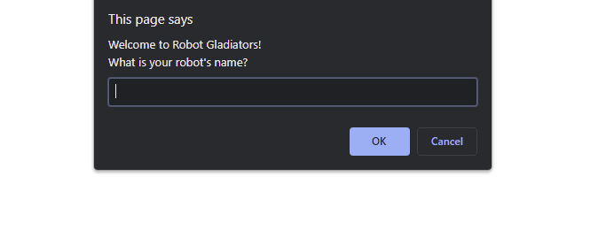

# Robot Gladiators

Name your robot and face off against 3 rounds of enemy robots! Chose your actions carefully and with a little luck you, may survive all three opponents and attain a new high score!

## Directions

This is a JavaScript alert and prompt game. Follow the alerts and prompts instructions to:
* Set your robot name
* Select to fight or skip a round
    * Skipping will diminish your score
* If you wind a round, feel free to visit the shop to purchase health or an attack upgrade

Keep in mind the following facts: 
* Your starting health is 100
* Your starting attack max is 15
* Your starting score is 10
* Enemy robot health is randomly decided between 40 and 60
* Enemy attack max is randomly decided between 10 and 14
* The starting attack order is randomly decided
* The damage from each attack by you OR your enemy is randomly decided between the attack max and 9 points less than the max
* The points you earn from clearing each round is randomly decided between 3 and 10.
* If you lose your robot in battle, you don't get to save your score.

If you win all three rounds AND have a new high score (this is persistent through localStorage), your robot name and score will be saved. 

How high of a score can you get??

## Screenshot

## Link
https://sirubu.github.io/robot-gladiators/